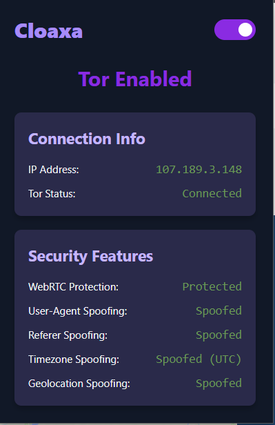
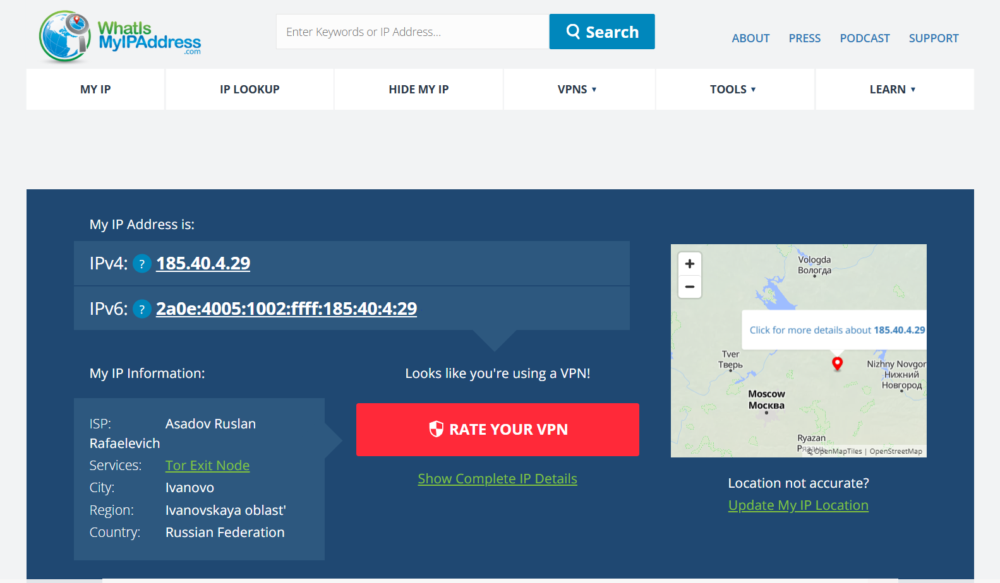

# Cloaxa 🧅

 

Cloaxa is a browser extension designed to enhance your online privacy by routing your web traffic through the Tor network and implementing various anti-tracking measures.

## ⚙️ How it Works

This extension configures your browser to use a SOCKS5 proxy running on `127.0.0.1:9050`, which is the default address for the Tor service. It also implements additional features to prevent common tracking and fingerprinting techniques.

## ✨ Features

*   **IP Masking via Tor:** Routes your browser's traffic through the Tor network, effectively masking your real IP address.
*   **WebRTC Leak Prevention:** Implements measures to prevent WebRTC from revealing your real IP address.
*   **Kill Switch:** Automatically blocks all browser network traffic if the connection to the Tor proxy is lost, preventing accidental IP leaks.
*   **HTTP Header Control:** Spoofs common HTTP headers like `User-Agent` and `Referer` to make it harder for websites to identify and track your browser.
*   **Timezone Spoofing:** Reports a generic UTC timezone to websites, helping to mitigate timezone-based browser fingerprinting.
*   **Geolocation Spoofing:** Intercepts geolocation requests and provides a generic, fake location to prevent websites from accessing your real physical coordinates.
*   **Persistence:** The extension's state (Tor enabled/disabled) is saved and restored across browser sessions.

## ✨ How it looks like:

<table>
  <tr>
  <td></td>
  <td> </td>
   </tr>
</table>

## ⚔️ Difference Between VPN and Cloaxa

## 📋 Prerequisites

**Important:** This extension requires the **standalone Tor service**, not the Tor Browser. The Tor Browser and the standalone Tor service are different applications.

You must install and run the Tor service on your local machine.

**Windows:**

1.  Download the "Expert Bundle" from the [Tor Project website](https://www.torproject.org/download/tor/).
2.  Extract the files to a desired location.
3.  Navigate to the extracted folder in your File Explorer.
4.  Find `tor` folder -> `tor.exe` (path is: extracted-folder/tor/tor.exe)
5.  Double click `tor.exe` to run and wait for it to connect.

**macOS:**

1.  Install Homebrew if you don't have it: `/bin/bash -c "$(curl -fsSL https://raw.githubusercontent.com/Homebrew/install/HEAD/install.sh)"`
2.  Install Tor: `brew install tor`
3.  Start the Tor service: `brew services start tor`

**Linux (Debian/Ubuntu):**

1.  Install Tor: `sudo apt-get install tor`
2.  The Tor service should start automatically. You can check its status with: `sudo systemctl status tor`

Once the Tor service is running, it will open a SOCKS5 proxy on `127.0.0.1:9050`, which this extension will use.

## 🚀 Installation

**Warning:** This extension currently only works on Chromium-based browsers (e.g., Chrome, Edge, Brave).

1.  Clone this repository or download the source code.
2.  Open your Chromium-based browser (e.g., Chrome, Edge).
3.  Go to `chrome://extensions`.
4.  Enable "Developer mode".
5.  Click "Load unpacked" and select the directory where you saved the source code (Cloaxa).

## 📖 Usage

1.  Make sure the Tor service is running on your machine.
2.  Click the Cloaxa icon in your browser's toolbar.
3.  Use the toggle switch to enable or disable Tor routing.

## ⚠️ Limitations

*   **Browser-Level Only:** This extension only affects traffic originating from the browser. It does not provide system-wide IP masking like a full VPN client.
*   **External Tor Dependency:** It relies on a locally running Tor service. It does not provide the Tor network access itself.
*   **Advanced Fingerprinting:** While it implements several anti-fingerprinting measures, highly sophisticated tracking techniques might still exist that could potentially bypass these overrides.

## 📜 Disclaimer

This extension aims to enhance privacy but may not provide the same level of security as the Tor Browser for all use cases. Use it at your own risk.
